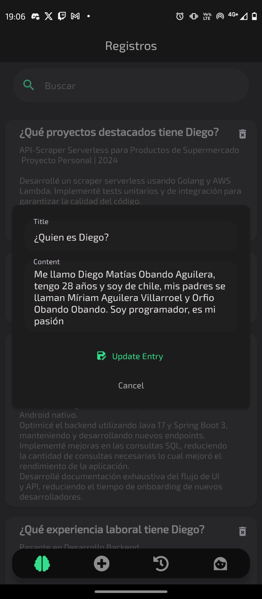
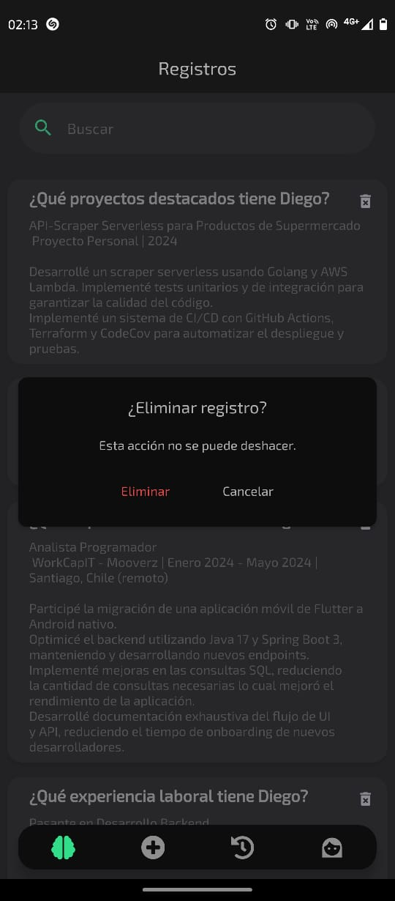
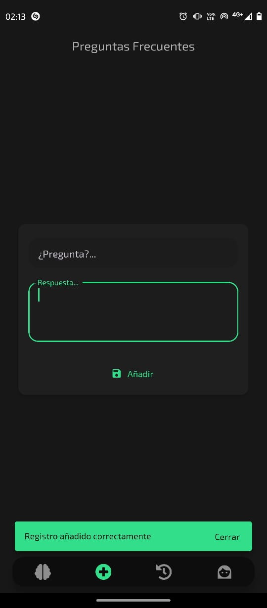
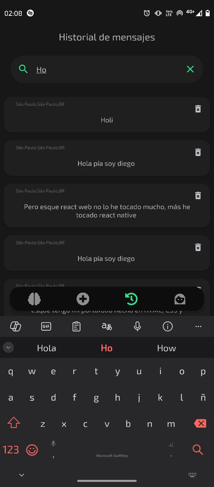
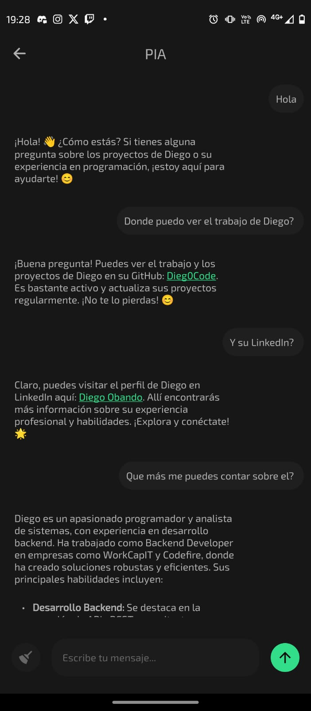

# App Personal Intelligent Assistant

App mobile creada con Expo router, TypeScript, React Native y Zustand. Permite agregar, editar, eliminar y buscar registros, en el corpus de conocimiento de PIA (Personal Intelligent Assistant). PIA posteriormente puede hacer búsquedas semánticas en la base de datos para responder consultas en lenguaje natural.

## Instalación

```bash
npm install
```

Variables de entorno:

Es necesario crear un archivo `.env` en la raíz del proyecto con las siguientes variables:

```bash
EXPO_PUBLIC_SUPABASE_URL=https://<supabase-url>.supabase.co
EXPO_PUBLIC_SUPABASE_ANON_KEY=<supabase-anon-key>
```

## Uso

```bash
npx expo start
```

## Features

La app cuenta con las siguientes funcionalidades:

- Autenticación con Biométrica.
- CRUD de registros.
- Búsqueda semántica.
- Chatbot potenciado con RAG (Retrieval Augmented Generation).

<div style="display: flex; flex-wrap: wrap; justify-content: space-around;">
  
  
  
  
  
  
  
  
  
  
</div>
