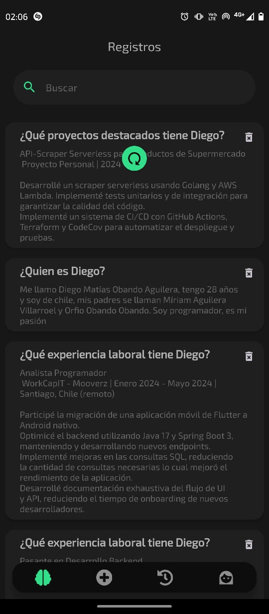
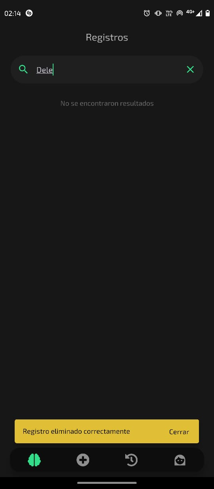

# App Personal Intelligent Assistant

App mobile creada con Expo router, TypeScript, React Native y Zustand. Permite agregar, editar, eliminar y buscar registros, en el corpus de conocimiento de PIA (Personal Intelligent Assistant). PIA posteriormente puede hacer búsquedas semánticas en la base de datos para responder consultas en lenguaje natural.

## Instalación

```bash
npm install
```

Variables de entorno:

Es necesario crear un archivo `.env` en la raíz del proyecto con las siguientes variables:

```bash
EXPO_PUBLIC_SUPABASE_URL=https://<supabase-url>.supabase.co
EXPO_PUBLIC_SUPABASE_ANON_KEY=<supabase-anon-key>
```

## Uso

```bash
npx expo start
```

## Features

La app cuenta con las siguientes funcionalidades:

- Autenticación Biométrica.
- CRUD de registros.
- Búsqueda semántica.
- Chatbot potenciado con RAG (Retrieval Augmented Generation).

<div style="display: flex; flex-wrap: wrap; justify-content: space-around;">
  
  
  
  
  
  
  
  
  
  
</div>

## Sobre PIA

PIA (Personal Intelligent Assistant) es un sistema basado en inteligencia artificial potenciado con `RAG` (Retrieval Augmented Generation). La tecnología RAG permite añadir información adicional a la inteligencia artificial que de otra forma no tendría acceso, en este caso es información sobre mi. PIA es capaz de responder preguntas en lenguaje natural, realizar búsquedas semánticas en la base de datos y aprender de las interacciones con el usuario.

El backend de PIA está desarrollado en `Golang`, puedes ver el código fuente en el siguiente [repositorio](https://github.com/Dieg0Code/portfolio_04_personal_intelligent_assistant).

También puedes interactuar con PIA en mi [sitio web](https://dieg0code.site).
